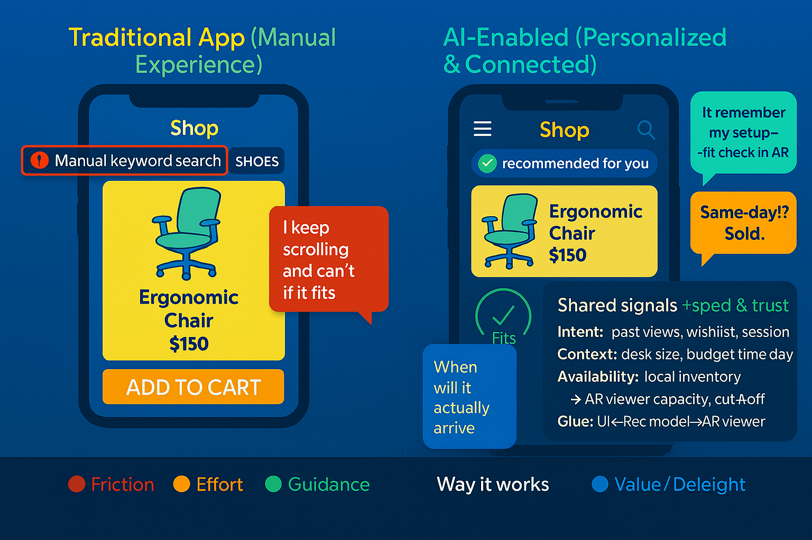

# 🛍️ The Future of AI in Customer-Facing Websites

 
---

## ☕ A short, human story

You open the app with a coffee in hand. The front page is short and useful — the top item is an ergonomic chair you viewed last week.

- Tap: quick AR preview shows it fits your desk.  
- Tap: the app shows the nearest warehouse and a same‑day delivery estimate.

Why it works: the UI, recommendation model, AR viewer, and inventory system share a few clean signals (intent, context, availability). Those signals make the experience fast and trustworthy.
<!-- Example hero image showing an AI-powered shopping app -->
<figure style="text-align:center;margin:18px 0">
	
	<figcaption style="font-size:0.95em;color:#6b7280;margin-top:8px">An example AI-powered app experience: personalized picks, fast previews and clear delivery options.</figcaption>
</figure>

### Comparison — story vs today

| Today's traditional experience | The AI‑enhanced story (you open the app with coffee) |
|---|---|
| Entry: You open the app and typically see generic banners, trending items, or a search box; you must search or browse to find what you saw previously. | Entry: The app opens to a short, useful front page tailored to you — the top item is the ergonomic chair you viewed last week. |
| Discovery: Manual search or broad recommendations; finding the exact item can take several steps. | Discovery: High‑relevance items are surfaced immediately based on recent activity and session context. |
| Visualization: Static photos and long product pages; previews are separate and slow. | Visualization: Fast, inline previews let you verify fit and look with minimal friction. |
| Decision support: Little explanation for recommendations; shipping and availability are generic. | Decision support: Clear signals about why an item is shown and realistic availability so you can decide faster. |
| Support: Help is often hidden behind menus or slow chatbots. | Support: Lightweight in‑context help and a clear path to human support if needed. |
| Privacy: Default settings are usually broad; users seldom see what is remembered. | Privacy: Short, visible prompts explain what the app remembers and give control at a glance. |
| Outcome: More effort, slower decisions, potential frustration. | Outcome: Faster decisions, higher confidence, reduced friction and better user satisfaction. |
<figure style="text-align:center;margin:18px 0">
	
		<figcaption style="font-size:0.9em;color:#6b7280;margin-top:8px">Flow: a visitor expresses intent → the site personalizes what they see → they visualize a product and decide faster.</figcaption>
</figure>
---

## 🔎 Five plain trends you’ll see

- Personal touch: the page shows things you care about right away.
- Ask & answer: small chat boxes or search that actually help when you ask a question.
- Try it visually: quick previews or images that show the item in context.
- Smarter stock info: clear delivery options and nearby pickup so you know when you’ll get it.
- Respectful data use: simple choices about what the site remembers about you.

## 💡 Why this matters (in everyday terms)

- People decide faster when they see what matters to them. That means more sales.
- Simple previews and clear shipping info reduce returns and questions.
- Showing respect for privacy builds trust — and repeat customers.

---

## ⚠️ High‑level pitfalls (no technical guidance)

- Over‑personalization can narrow discovery and make experiences feel repetitive.
- Opaque recommendations risk user distrust if reasons are not visible.
- Privacy concerns when personalization feels intrusive.
- Biased signals can produce unfair or poor recommendations for some users.
- Feature fragility: if advanced previews or availability data fail, the experience can break.

---

## Concrete benefits (outcomes to watch for)

- Reduced time‑to‑decision: users reach a purchase or save action faster.
- Higher engagement and conversion for surfaced items.
- Fewer returns and support tickets when previews/availability match reality.
- Stronger repeat visits when the front page feels immediately useful and respectful.

---

## ✨ Final thought — short and useful

Make online shopping feel a little more human: show people what matters, give clear previews and delivery info, and make it easy to talk to a person.

If you want, I can insert this cleaned section into the post in a different location or export it as a standalone snippet — tell me which you prefer.
