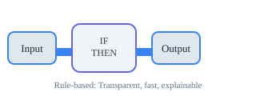

# Model Selection in AI: A Practical Guide for Leaders and Practitioners

Choosing the right model is one of the most important decisions in any AI or analytics project. This post explains the main types of models, how they work, and when to use them—plus how both formal and informal learning shape our ability to make good decisions, in AI and in our own brains.

## Why Model Selection Matters

The model you choose shapes not just the technical solution, but the business outcome, the risks, and the long-term maintainability of your product. Good model selection is about fit: fit to the problem, the data, the team, and the organization's goals.

## 1. Rule-Based Models (Heuristics)
- **What it is:** Explicit rules or logic ("if this, then that") crafted by experts or derived from data patterns.
- **When to use:** When the problem is well-understood, data is limited, or transparency is critical. Great for compliance, safety, or when you need fast, explainable decisions.
- **Example:** Fraud detection rules, eligibility checklists, or simple routing logic.

- **Diagram explanation:** The diagram illustrates a simple flowchart: input data enters a decision block with explicit "if-then" rules, leading to clear, explainable outputs. This highlights the transparency and straightforward logic of rule-based systems.

## 2. Classical Machine Learning (Supervised/Unsupervised)
- **What it is:** Algorithms that learn from labeled (supervised) or unlabeled (unsupervised) data to find patterns, make predictions, or group similar items.
- **When to use:** When you have enough historical data and a clear target (supervised), or want to discover structure in data (unsupervised).
- **Example:** Regression for forecasting, classification for spam detection, clustering for customer segmentation.
- **Long-term note:** Requires ongoing data quality and monitoring; can drift if the world changes.

## 3. Deep Learning (Neural Networks)
- **What it is:** Multi-layered models inspired by the brain, capable of learning complex patterns from large, high-dimensional data (images, text, audio).
- **When to use:** When the problem is too complex for rules or classical ML, and you have lots of data and compute.
- **Example:** Image recognition, language translation, speech-to-text.
- **Long-term note:** Powerful but opaque; needs significant resources and careful monitoring for bias and drift.

## 4. Reinforcement Learning
- **What it is:** Models that learn by trial and error, receiving feedback (rewards or penalties) from their environment.
- **When to use:** For sequential decision-making problems where actions have long-term consequences (robotics, game playing, dynamic pricing).
- **Example:** AlphaGo, self-driving car navigation, personalized recommendations that adapt over time.
- **Long-term note:** Can discover novel strategies, but may be unpredictable or unsafe without strong constraints.

## 5. Informal Learning (Human-in-the-Loop, Social Learning)
- **What it is:** Systems that combine formal models with human judgment, feedback, or social cues. Mirrors how people learn from both instruction and experience.
- **When to use:** When stakes are high, data is ambiguous, or context changes rapidly. Useful for edge cases, ethical decisions, or when trust is paramount.
- **Example:** Moderation systems with escalation to humans, collaborative filtering with user feedback, expert-in-the-loop medical diagnosis.
- **Long-term note:** Builds resilience and trust, but requires investment in process and culture.

## 6. Ensemble Models
- **What it is:** Combine multiple models (often of different types) to improve accuracy and robustness. Examples include bagging, boosting, and stacking.
- **When to use:** When single models are unstable or you want to reduce variance and bias.
- **Example:** Random Forests (many decision trees), Gradient Boosting Machines (GBM), model stacking in competitions.
- **Long-term note:** Can be powerful but may be harder to interpret and maintain.

## 7. Bayesian Models
- **What it is:** Models that use probability distributions to represent uncertainty and update beliefs as new data arrives.
- **When to use:** When you need to quantify uncertainty, incorporate prior knowledge, or work with small datasets.
- **Example:** Bayesian A/B testing, spam filtering, probabilistic forecasting.
- **Long-term note:** Great for decision-making under uncertainty, but can be computationally intensive.

## 8. Generative Models
- **What it is:** Models that can generate new data similar to what they were trained on (images, text, audio).
- **When to use:** For creative tasks, data augmentation, or simulating scenarios.
- **Example:** GANs (Generative Adversarial Networks), VAEs (Variational Autoencoders), large language models (LLMs).
- **Long-term note:** Can create realistic outputs, but may hallucinate or be hard to control.

## 9. Transfer Learning
- **What it is:** Reusing a model trained on one task as the starting point for a new, related task.
- **When to use:** When you have limited data for your problem but can leverage a model trained on a larger dataset.
- **Example:** Using ImageNet-trained models for medical imaging, fine-tuning language models for chatbots.
- **Long-term note:** Accelerates development and can improve performance, but requires careful adaptation.

## 10. Graph-Based Models
- **What it is:** Models that operate on data structured as graphs (nodes and edges), capturing relationships and dependencies.
- **When to use:** For social networks, recommendation systems, fraud detection, or any domain where relationships matter.
- **Example:** Graph Neural Networks (GNNs), PageRank, knowledge graphs.
- **Long-term note:** Powerful for relational data, but can be complex to scale and interpret.

---

## How to Decide: A Practical Checklist
- **Start simple:** Use rules or classical ML if possible. Only move to deep or reinforcement learning if the problem demands it.
- **Consider data, risk, and explainability:** More complex models need more data, more monitoring, and often less transparency.
- **Mix and match:** Many robust systems combine models (e.g., rules for safety, ML for optimization, humans for oversight).
- **Plan for change:** The best model today may not be the best tomorrow—design for learning and adaptation.

## Formal and Informal Learning: Training the Brain (and the Model)

Just as our brains learn through both formal instruction (school, training) and informal experience (trial, error, social cues), the best AI solutions often blend multiple approaches. Formal models provide structure and repeatability; informal learning brings flexibility, context, and resilience.

- **Formal learning:** Structured, curriculum-based, repeatable. In AI: supervised learning, rules, algorithms.
- **Informal learning:** Experience-based, social, adaptive. In AI: human-in-the-loop, feedback loops, collaborative filtering.

## Decision-Making for the Long Term

- **Think beyond launch:** The right model is the one you can maintain, monitor, and improve as the world changes.
- **Build for trust:** Transparency, human oversight, and feedback channels are as important as accuracy.
- **Keep learning:** Both your team and your models should be able to adapt as new data and challenges arise.

**The goal isn’t to pick the fanciest model, but the one that fits your problem, your data, and your long-term strategy.**
