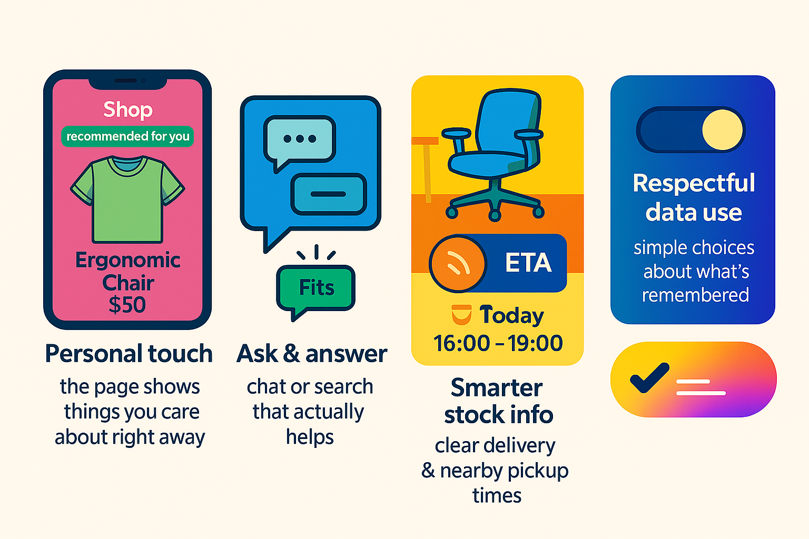
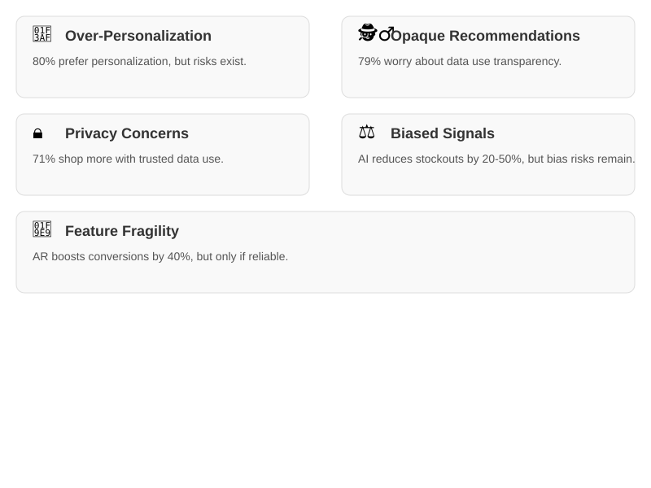

# 🛍️ The Future of AI in Customer-Facing Websites 
---

## ☕ A short, human story

Picture this: it’s a quiet morning, and you’re sipping coffee as you open your favorite shopping app. Instead of a cluttered homepage filled with irrelevant banners, the app feels like it knows you. Right there, front and center, is the ergonomic chair you’ve been considering — no searching, no hassle.

Curious, you tap once. Instantly, an augmented reality preview shows the chair in your home office. It fits perfectly, complementing your desk and space. Another tap, and the app reveals the nearest warehouse with same-day delivery available. It’s seamless, intuitive, and fast — almost like the app is reading your mind.

Now, think about how this compares to a traditional app experience. You’d likely start with a generic homepage, scrolling past trending items or typing keywords into a search bar. After sifting through pages of results, you might find the chair, but you’d still be left guessing if it fits your space or when it might arrive. Frustrating, isn’t it?

This is the difference an AI-enhanced app makes. By combining smart recommendations, real-time inventory updates, and AR previews, it transforms shopping into a personalized, delightful experience. It’s not just convenient — it’s designed for you.

<!-- Example hero image showing an AI-powered shopping app -->
<figure style="text-align:center;margin:18px 0">
	
	<figcaption style="font-size:0.95em;color:#6b7280;margin-top:8px">An example AI-powered app experience: personalized picks, fast previews and clear delivery options.</figcaption>
</figure>

### Comparison — Today vs Future

| Today's traditional experience | The AI‑enhanced story (you open the app with coffee) |
|---|---|
| **Entry**: You open the app and typically see generic banners, trending items, or a search box; you must search or browse to find what you saw previously. | **Entry**: The app opens to a short, useful front page tailored to you — the top item is the ergonomic chair you viewed last week. |
| **Discovery**: Manual search or broad recommendations; finding the exact item can take several steps. | **Discovery**: High‑relevance items are surfaced immediately based on recent activity and session context. |
| **Visualization**: Static photos and long product pages; previews are separate and slow. | **Visualization**: Fast, inline previews let you verify fit and look with minimal friction. |
| **Decision support**: Little explanation for recommendations; shipping and availability are generic. |**Decision support**: Clear signals about why an item is shown and realistic availability so you can decide faster. |
| **Support**: Help is often hidden behind menus or slow chatbots. | **Support**: Lightweight in‑context help and a clear path to human support if needed. |
| **Privacy**: Default settings are usually broad; users seldom see what is remembered. | **Privacy**: Short, visible prompts explain what the app remembers and give control at a glance. |
| **Outcome**: More effort, slower decisions, potential frustration. | **Outcome**: Faster decisions, higher confidence, reduced friction and better user satisfaction. |
<figure style="text-align:center;margin:18px 0">
	
		<figcaption style="font-size:0.9em;color:#6b7280;margin-top:8px">Flow: a visitor expresses intent → the site personalizes what they see → they visualize a product and decide faster.</figcaption>
</figure>

---

## 🔎 Five trends shaping the future of customer-facing websites

<figure style="text-align:center;margin:18px 0">
    
    <figcaption style="font-size:0.95em;color:#6b7280;margin-top:8px">Five trends shaping the future of customer-facing websites.</figcaption>
</figure>

- **A personal touch that feels human**: Imagine opening a page that instantly shows you what you care about most — **no digging, no distractions, just relevance.
- **Conversations that actually help**: Small chat boxes or search bars that don’t just answer questions but anticipate them, guiding you to what you need.
- **See it before you buy it**: Visual previews or AR tools that let you try items in your space, making decisions faster and more confident.
- **Smarter stock insights**: Clear delivery options and nearby pickup availability so you know exactly when and where you’ll get your item.
- **Respect for your data**: Simple, transparent choices about what the site remembers about you, building trust with every interaction.

## 💡 Why this matters (in everyday terms)

- 🕒 **Faster decisions**: People decide quickly when they see what matters to them — ***leading to more sales***.
- 👁️ **Fewer returns & questions**: Simple previews and clear shipping info ***reduce returns and customer support queries***.
- 🤝 **Trust & loyalty**: Showing respect for privacy ***builds trust and encourages repeat customers***.

---

## ⚠️ High‑level pitfalls

<figure style="text-align:center;margin:18px 0">
    
    <figcaption style="font-size:0.95em;color:#6b7280;margin-top:8px">A visual summary of high-level pitfalls and their associated statistics.</figcaption>
</figure>

- 🎯 **Over‑personalization** can narrow discovery and make experiences feel repetitive. While personalization can boost engagement, overdoing it may limit users to a bubble of similar items, reducing opportunities for discovery and serendipity. [Source: McKinsey](https://www.mckinsey.com/business-functions/marketing-and-sales/our-insights/the-future-of-personalization)

- 🕵️‍♂️ **Opaque recommendations** risk user distrust if reasons are not visible. Users are more likely to trust recommendations when they understand why they are being shown certain items. Lack of transparency can lead to skepticism and reduced engagement. [Source: Accenture](https://www.accenture.com/us-en/insights/technology/putting-human-first-data-driven-marketing)

- 🔒 **Privacy concerns** when personalization feels intrusive. Consumers value their privacy and may feel uncomfortable if they perceive that too much personal data is being used without clear consent. Transparent data practices are essential to building trust. [Source: Pew Research](https://www.pewresearch.org/fact-tank/2019/11/15/americans-and-privacy-concerned-confused-and-feeling-lack-of-control-over-their-personal-information/)

- ⚖️ **Biased signals** can produce unfair or poor recommendations for some users. AI systems trained on biased data can unintentionally reinforce stereotypes or exclude certain groups, leading to a less inclusive experience. Regular audits and diverse training data are critical. Research indicates that companies using AI for inventory management report a 20-50% reduction in stockouts, but biased algorithms can skew these benefits. [Source: BCG](https://www.bcg.com/publications/2021/ai-in-supply-chain-management)

- 🧩 **Feature fragility**: if advanced previews or availability data fail, the experience can break. For example, an AR preview that doesn’t load or inaccurate inventory data can frustrate users and erode trust. Robust testing and fallback mechanisms are key. AR tools have been shown to increase conversion rates by up to 40%, but only when they function reliably. [Source: IBM](https://www.ibm.com/blogs/watson/2020/07/the-value-of-ai-powered-chatbots-in-customer-service/)

---

## Concrete benefits (outcomes to watch for)

- **Reduced time‑to‑decision**: users reach a purchase or save action faster.
- **Higher engagement and conversion** for surfaced items.
- **Fewer returns and support tickets** when previews/availability match reality.
- **Stronger repeat visits** when the front page feels immediately useful and respectful.

---

## ✨ Final thought — making online shopping human again

Online shopping doesn’t have to feel like a chore. By showing people what truly matters to them, offering clear previews, and providing transparent delivery options, we can make the experience faster, easier, and more enjoyable. And when customers need help, a simple path to a real person can make all the difference.

The future of customer-facing websites isn’t just about technology — it’s about creating experiences that feel personal, intuitive, and human. Start small, measure the impact, and watch as trust and satisfaction grow with every interaction.
